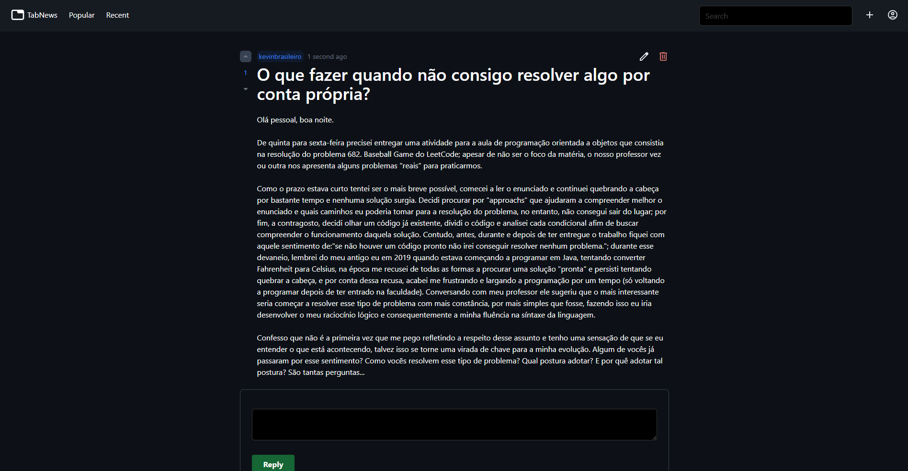
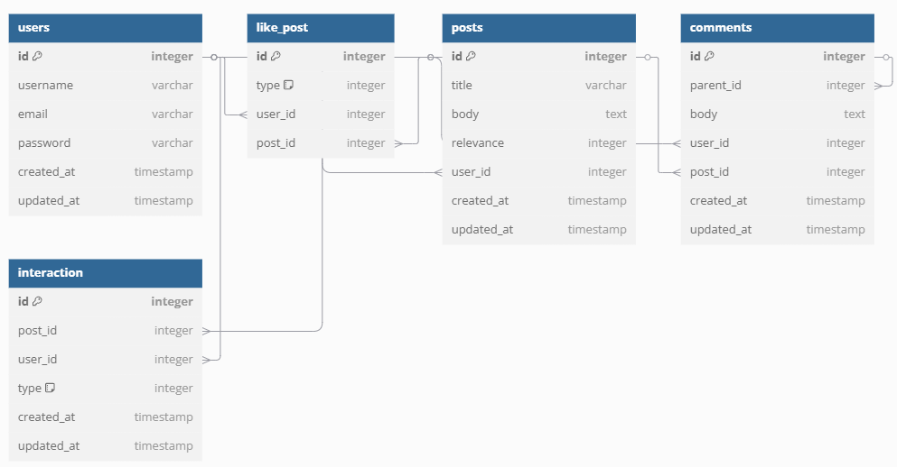

# Tabnews Clone

## About

Social media platform focused on educational and technology posts, developed in PHP/Laravel. This project was a learning challenge while following Laracasts' Laravel Path. 

Inspired by: [Tabnews](https://tabnews.com.br)

<p align="center" >
  
</p>

## Database Modelling

<p align="center">
  
</p>

## How to Run 

To clone and run this application, you'll need [npm](https://www.npmjs.com/), [Git](https://git-scm.com/) and [Docker](https://www.docker.com/) installed on your computer. On your command line:

```sh
# Clone this repository
$ git clone https://github.com/kevinbrasileiro/tabnews-clone

# Go into the repository
$ cd tabnews-clone

# Install dependencies
$ npm install

# Run sail
$ ./vendor/bin/sail up -d

# Run the server
$ npm run dev

# APP_URL: http://localhost
```

## License

The Laravel framework is open-sourced software licensed under the [MIT license](https://opensource.org/licenses/MIT).
